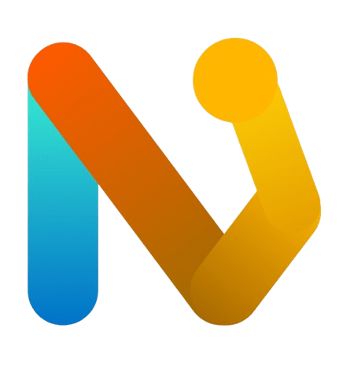

# NoraFit — Entrena. Registra. Progresa.

> **Propuesta de Valor:** NoraFit es una aplicación móvil gratuita que permite a los usuarios registrar, organizar y analizar sus entrenamientos de gimnasio sin suscripciones ni funciones bloqueadas.

---

##  Descripción

NoraFit es una aplicación móvil enfocada en el seguimiento de rutinas de entrenamiento.  
Permite registrar ejercicios, peso, repeticiones y tiempos de descanso, facilitando el monitoreo del progreso a largo plazo.

A diferencia de otras aplicaciones fitness, NoraFit elimina las barreras económicas y se centra únicamente en la funcionalidad esencial para progresar.

##  ¿Qué problema resuelve?

Muchas aplicaciones de entrenamiento bloquean funciones básicas como:

- Historial de ejercicios
- Seguimiento de progreso
- Registro ilimitado de rutinas

Esto obliga a los usuarios a pagar suscripciones mensuales.

NoraFit ofrece una solución completamente gratuita para que cualquier persona pueda llevar un control real de su progreso sin restricciones.

---

## Miembros

| Nombre | Rol | GitHub / Perfil |
| :--- | :--- | :--- |
| **Juan Pablo Peña** | Scrum Master & Management | [@jpenab02](https://github.com/jpenab02) |
| **Juan José Mendoza Marquez** | Configuration Manager & Frontend Developer | [@Juanvil1840](https://github.com/Juanvil1840) |
| **Santiago Martinez Cuellar** | Quality Assurance Lead (QA Lead) & Databases| [@Pochicard](https://github.com/Pochicard) |
| **Santiago Bautista Velasquez** | DevOps Engineer & Backend Developer | [@Santiago1213bv](https://github.com/Santiago1213bv) |
| **Santiago Alvarez Serrano** | Product Owner / Sprint Planner & Backend Developer | [@AlvarezSS](https://github.com/AlvarezSS) |

---

##  Tecnologías Utilizadas

* `Frontend`: Flutter
* `Backend`: Java – Spring Boot
* `Base de Datos`: PostgreSQL
* `Control de versiones`: Git

---

##  Contexto Académico
- **Asignatura:** Fundamentos de Ingeniería de Software
- **Docente:** Luis Gabriel Moreno Sandoval, PhD

---

## Contacto

**Equipo de desarrollo:**

**Juan José Mendoza Marquez**  
Estudiante de Ingeniería en Sistemas, Pontificia Universidad Javeriana  
📧 mendoza_@javeriana.edu.co

**Juan Pablo Peña Bernal**  
Estudiante de Ingeniería de Sistemas, Pontificia Universidad Javeriana  
📧 jp.penab@javeriana.edu.co  

**Santiago Bautista Velasquez**  
Estudiante de Ingeniería en Sistemas, Pontificia Universidad Javeriana  
📧 bautista_s@javeriana.edu.co

**Santiago Alvarez Serrano**  
Estudiante de Ingeniería en Sistemas, Pontificia Universidad Javeriana  
📧 alvarezs.s@javeriana.edu.co

**Santiago Martinez Cuellar**  
Estudiante de Ingeniería en Sistemas, Pontificia Universidad Javeriana  
📧 martinezcs@javeriana.edu.co

## Integrantes(GIT)

Santiago Martínez  
GitHub: https://github.com/Pochicard

---

## Licencia
Proyecto desarrollado con fines académicos.
